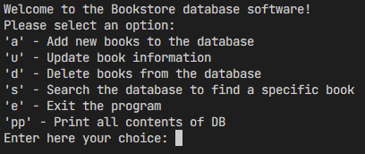

# finalCapstone
Repo for the final capstones of the  Hyperion Dev bootcamp

# Table of contents:
1. [Requirements ](#requirements)
1. [Installation ](#installation)
1. [Capstone 1: Variables and Control Structures](#capstone-1-variables-and-control-structures)
2. [Capstone 2: Files](#capstone-2-files)
3. [Capstone 3: Lists, Functions, and String Handling](#capstone-3-lists-functions-and-string-handling)
4. [Capstone 4: Object Oriented Programming](#capstone-4-object-oriented-programming)
5. [Capstone 5: Databases ](#capstone-5-databases)
6. [usage](#usage)
7. [Credits](#credits)

## Requirements
Python 3.0 or later. 

## Installation
Simply download the files into a folder and run them from there. 

The  files are not compiled, so you will need some software to run them. in VS code, for example:
- Open the project folder
- Open the desired .py file
- Run using your desired python interpreter.

 

## Capstone 1: Variables and Control Structures
In this task it was assumed I had been contacted by a small financial company and asked to create a program that allows the user to access two different financial calculators: an investment calculator and a home loan repayment calculator. The code does the following:

- The user is allowed to choose which calculation they want to do.  How the user capitalises their selection does not affect how the program proceeds. i.e. ‘Bond’, ‘bond’, ‘BOND’ or ‘investment’, ‘Investment’, ‘INVESTMENT’, etc., and are all recognised as valid entries. If the user doesn’t type in a valid input, the program shows an appropriate error  message.
- If the user selects ‘investment’, it does the following: 
    - The user is asked to input:
        - The amount of money that they are depositing.
        - The interest rate (as a percentage). Only the number of the interest rate should be entered. The user should enter 8 and not 8%. 
        - The number of years they plan on investing.
        - Then asks the user to input if they want “simple” or “compound” interest, and store this in a variable called interest. Depending on whether or not they typed
“simple” or “compound”, output the appropriate amount that they will get back after the given period, at the specified interest rate.
- If the user selects ‘bond’, it does the following:
    - Ask the user to input:
        - The present value of the house. e.g. 100000
        - The interest rate. e.g. 7
        - The number of months they plan to take to repay the bond. e.g. 120

Whatever is chosen, the program calculates the result and prints it accordingly. 
 

## Capstone 2: Files
In this project, I created a rogram for a small business that can help it to manage tasks assigned to each member of the team.

The program works with 2 files:
- user.txt
- tasks.txt

### users.txt
Stores username and password for each of the users. 

### tasks.txt
Stores the following data:
- The username of the person to whom the task is assigned.
- The title of the task.
- A description of the task.
- The date that the task was assigned to the user.
- The due date for the task.
- Either a ‘Yes’ or ‘No’ value that specifies if the task has been completed yet.

The program allows the users to:
- Login
- Register a user (when succesfully logged in)
- Add a task (admin user only)
- View all tasks (admin user only)
- View registered user's assigned tasks.

All the menu options were controlled through a user's input. 

 

## Capstone 3: Lists, Functions, and String Handling
This task builds on top of the previous one, and uses 2 .txt files for user and password verification and handling. 

The code was modifie so the following methods workes as described:
- reg_user — that is called when the user selects ‘r’ to register a user
- add_task — that is called when a user selects ‘a’ to add a new task
- view_all — that is called when users type ‘va’ to view all the tasks listed in ‘tasks.txt’.
- view_mine — that is called when users type ‘vm’ to view all the tasks that have been assigned to them

The reg_user method was modified to make sure that it does not allow to duplicate usernames when you add a new user to user.txt. If a user tries to add a username that already exists in user.txt, it provides a relevant error message and then allows them to try to add a user with a different username.

The view_mine method was modifed so:
- it displays all tasks in an easy to read way
- Allows the user to select either a specific task or to return to the main menu.
- When selecting a task, the user can mark it as completed.

 

## Capstone 4: Object oriented programming
This program manages the inventory of a shoeshop, and uses classes and instances of that class to keep track of different items information. 

### Class
In the class, the following fileds and properties are defined:
- Country
- Code
- Product name
- Cost
- Quantity

Inside this class  the following methods are defined:
- get_cost - Returns the cost of the shoes.
- get_quantity -Returns the quantity of the shoes.
- __str__ - This method returns a string representation of aclass.

### External methods:
- read_shoes_data - This function opens the file inventory.txt and reads the data from  his file, then creates a shoes object with this data and append this object into the
shoes list. One line in this file represents data to create one object of shoes.
- capture_shoes - This function allows a user to capture data about a shoe and uses this data to create a shoe object and appends this object inside the overall shoe list.
- view_all - This function will iterate over the shoes list and print the details of the shoes returned from the __str__ function. 
- re_stock - This function will find the shoe object with the lowest quantity, which is the shoes that need to be re-stocked. Ask the user if they want to add this quantity of shoes and then update it. This quantity should be updated on the file for this shoe.
- search_shoe - This function will search for a shoe from the list using the shoe code and  eturn this object so that it will be printed. 
- value_per_item - This function will calculate the total value for each item . Please keep the formula for value in mind; value = cost * quantity.
- highest_qty -  determines the product with the highest quantity and prints this shoe as being for sale.
 

### User menu

An interactive user menu calls these methods throught he following options:
- Read Shoes data.
- Capture Shoes.
- View all.
- Re stock.
- Search Shoe.
- Value per item.
- Highest Quantity.

## Capstone 5: Databases
In this task I created a progam in charge of managing the stock of a bookstore. 
it allowes the user to:
- Add new books to the database
- Update book information
- Delete books from the database
- Search the database to find a specific book.
- Print the contents of the database. 

The initial database had to respect the followign contents:
|  id | Title  |Author   |  Quantity |
|---|---|---|---|
| 3001  |  A tale of 2 cities | Charles Dickens  |123   |
|  3002 |  Harry Potter | J.K. Rowling  | 56  |   
|  3003 |  The Lion the Witch and the Wardrobe | C.S. Lewis  | 45  |   
| 3004  |  The Lord of ther Rings | J.R.R. Tolkien  | 12  |   
|  3005 |  Alice in Wonderland | Lewis Carroll  | 69  |   

The program presents the user with the following menu:
1. Enter book
2. Update book
3. Delete book
4. Search books
0. Exit

Each of these functions is implemented in a single method. There is a really cool one to manage and validate user's input im specially proud of. Hope you like it!

## Usage

The use of the programs is fairly simple, and all interaction is made throught text interfaces and inputs like the following: 

 
<em>Generic image of a menu in the programs</em>

 

## Credits

All the project capstones were coded by me with assistance of extensive google searching. 